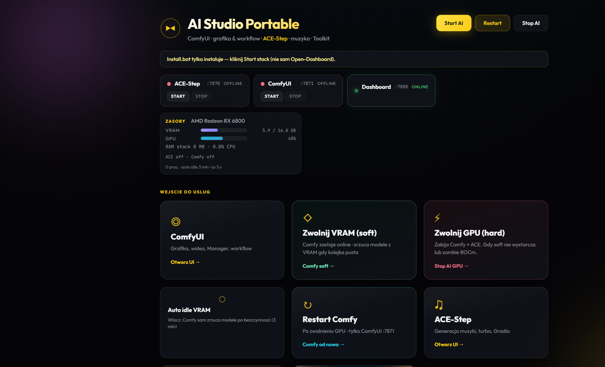
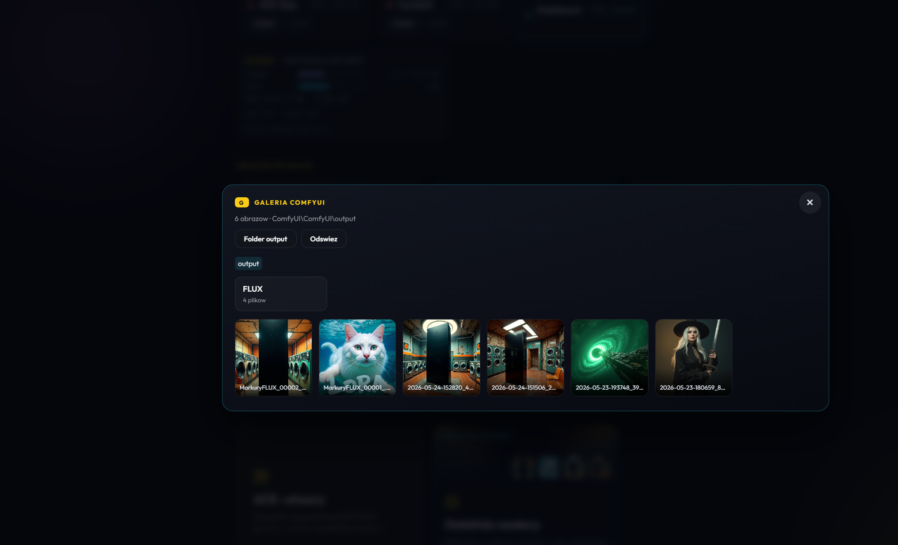
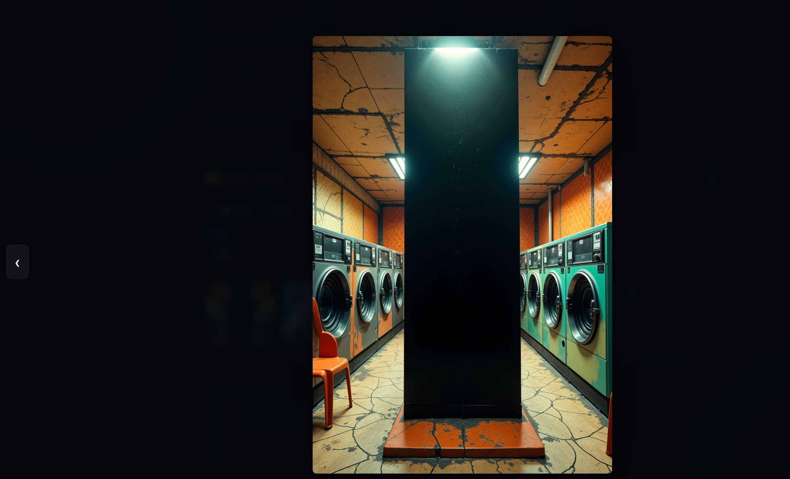

# AI Studio

> **This repo is AI Studio only** — ComfyUI + ACE-Step creative stack (`:7880` hub).
> Not [Brain AI Hub](https://github.com/lobrzut/brain) (Ollama vault/RAG/MCP, `:7860`) or [NetDash](https://github.com/lobrzut/netdash) (homelab dashboard, `:18787`).
> Comparison table: [brain/docs/HOMELAB-PROJECTS.md](https://github.com/lobrzut/brain/blob/main/docs/HOMELAB-PROJECTS.md)

Portable AI creative stack for **Windows** and **Linux** — one repository, shared dashboard, platform-specific installers.

Generate images and video with **ComfyUI**, music with **ACE-Step**, and handle audio post-production from a single **dashboard hub** (`:7880`): service control, GPU helpers, Comfy output gallery, drag-and-drop mastering/stems/lyrics, and more.

| Edition | Target | Install |
|---------|--------|---------|
| **Windows** | Desktop workstation, USB-portable folder, RX 6800 / ROCm | `Install.bat` → `Start.bat` |
| **Linux** | Debian/Ubuntu server or homelab | `curl …/linux/bootstrap.sh \| sudo bash` |

Dashboard and main scripts support **Polish** and **English** (PL/EN switcher in the header).

---

## Quick start — Windows

| File | What it does |
|------|----------------|
| `Install.bat` | First-time setup (GPU profile, Python runtime, ComfyUI + ACE-Step + Manager, optional Enhance AI) |
| `Start.bat` | Tray icon + dashboard hub; start ACE/Comfy from UI |
| `Stop.bat` | Stops ACE, Comfy, and hub |
| `Restart.bat` | Full stop + start cycle |
| `Open-Dashboard.bat` | Opens `http://127.0.0.1:7880/` |

Typical flow:

1. Run `Install.bat` once (new PC or after copying the folder).
2. Run `Start.bat`.
3. Open **http://127.0.0.1:7880/**.
4. Click **Start AI** or launch ComfyUI / ACE-Step from the dashboard.

Stack files live under `windows/` (`ComfyUI/`, `ACE-Step/`, `Toolkit/`). Root `.bat` files are shortcuts into that folder.

---

## Quick start — Linux

One command on Debian / Ubuntu:

```bash
curl -fsSL https://raw.githubusercontent.com/lobrzut/ai-studio/main/linux/bootstrap.sh | sudo bash
```

Default install path: `/opt/ai-studio`. Data: `/var/lib/ai-studio`.

```bash
# CPU-only hub
curl -fsSL .../linux/bootstrap.sh | sudo bash -s -- --profile cpu

# AMD ROCm (native ComfyUI on host)
curl -fsSL .../linux/bootstrap.sh | sudo bash -s -- --profile native-rocm
```

Details: [`linux/README.md`](linux/README.md).

---

## What's inside

```
ai-studio/
├── Install.bat / Start.bat / …     # Windows entrypoints
├── shared/
│   ├── web/                        # Dashboard UI (PL/EN), gallery, lightbox
│   └── hub/                        # Hub API (Python — Linux; Windows uses Toolkit PS hub)
├── windows/                        # Portable Windows stack
│   ├── ComfyUI/                    # Image/video workflows, Manager
│   ├── ACE-Step/                   # Music generation (Gradio)
│   └── Toolkit/                    # Tray, post-prod scripts, GPU tools
├── linux/                          # Bootstrap, Docker, systemd
└── docs/                           # Screenshots, security, GitHub texts
```

### Ports (both editions)

| Port | Service |
|------|---------|
| `7880` | Dashboard hub |
| `7871` | ComfyUI |
| `7870` | ACE-Step |

### Toolkit (audio post-prod)

Drag-and-drop on the dashboard (Windows hub) or matching scripts in `windows/Toolkit/`:

- **Master** — loudness normalization (LUFS)
- **Stems** — Demucs separation (4 tracks)
- **Match** — auto-mastering vs reference track
- **Lyrics** — Whisper → LRC / SRT / VTT
- **Fix silence** — scan gaps for ACE-Step Repaint
- **Enhance** — light (ffmpeg) / medium (AI) / heavy (Comfy queue)

---

## Dashboard preview

### Home — stack control, GPU meter, launch pad



### ComfyUI gallery



### Lightbox



---

## Languages (PL / EN)

- Switch in the dashboard header (**PL** / **EN**).
- Windows: tray menu → **Language**.
- Preference: `windows/Toolkit/locale.env` (not committed).

---

## Hardware notes

- **Windows:** tuned for portable folder + AMD ROCm (e.g. RX 6800); NVIDIA and CPU profiles supported.
- **Linux:** auto-detects NVIDIA (Docker + CUDA) or ROCm (native path); CPU fallback runs the hub in Docker.
- Profile files (`gpu_profile.env`, `gpu-idle.env`, `locale.env`) are machine-specific — see `.gitignore`.

---

## Important

- Do **not** commit runtimes, models, logs, or personal outputs (see `.gitignore`).
- Before publishing or sharing the repo: read [`docs/SECURITY_AUDIT.md`](docs/SECURITY_AUDIT.md).
- Edition comparison: [`docs/PROJECT.md`](docs/PROJECT.md).

### GitHub helpers (Windows)

```powershell
.\windows\Publish-First-Commit.ps1
.\Push-To-GitHub.ps1
```

Repo profile copy/paste: [`docs/github/REPO_ABOUT.md`](docs/github/REPO_ABOUT.md).

---

## License

See [LICENSE](LICENSE).
